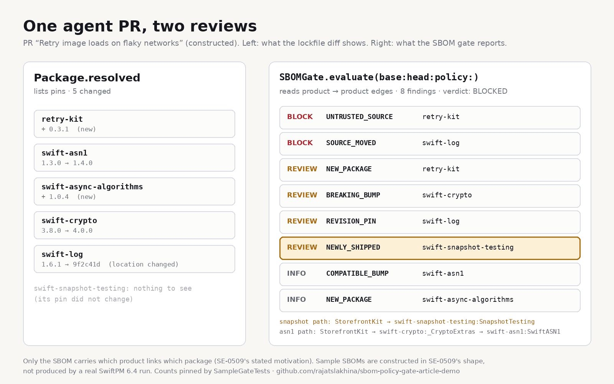

# SBOMGate

**A dependency gate for Swift 6.4's SwiftPM SBOMs.** Feed it the CycloneDX SBOM of the merge base and of a PR head, plus a policy file your team owns, and it tells you which dependency changes a human has to look at, and *why each one ships*.

Article: [Swift 6.4 Is a Governance Release. Its SBOM Caught What My Lockfile Diff Couldn't.](https://medium.com/@er.rajatlakhina/swift-6-4-is-a-governance-release-its-sbom-caught-what-my-lockfile-diff-couldnt-ce82448be862)



## Why

Swift 6.4 shipped SE-0509: `swift build --sbom-spec cyclonedx` (and `swift package generate-sbom`) now emits a CycloneDX 1.7 or SPDX 3.0 SBOM with **product-to-product edges**. `Package.resolved` only lists pins. It can't tell you that a test helper is now linked into the app. It does show a changed `location` when `swift-log` starts coming from a fork, but it's one line among many, and because SwiftPM derives a package's identity from the last path component of its URL ([SE-0292](https://github.com/swiftlang/swift-evolution/blob/main/proposals/0292-package-registry-service.md)), the fork keeps the name `swift-log`.

When a coding agent is opening a large share of your PRs, the dependency graph is governed by what CI can check, not by what the style guide says. This package is that check.

## What it does

The policy is a JSON file you keep next to `Package.swift`, so loosening it is a reviewed diff like any other (see `docs/dependency-policy.example.json`):

```json
{ "trustedSources": ["github.com/apple", "github.com/swiftlang"], "blockRevisionPins": false }
```

```swift
import Foundation
import SBOMGate

// Base and head generated with the same command, default --sbom-filter all:
//   swift package generate-sbom --sbom-spec cyclonedx --sbom-output-dir sbom/
let baseSBOM = try String(contentsOfFile: "sbom/base.cyclonedx.json", encoding: .utf8)
let headSBOM = try String(contentsOfFile: "sbom/head.cyclonedx.json", encoding: .utf8)
let policy = try DependencyPolicy.load(from: URL(fileURLWithPath: "dependency-policy.json"))
let report = try SBOMGate.evaluate(baseJSON: baseSBOM, headJSON: headSBOM, policy: policy)

switch report.verdict {
case .blocked:
    report.findings.forEach { print($0.severity.label, $0.rule.rawValue, $0.package, $0.message) }
    exit(1)
case .needsReview:
    print("Dependency-owner review needed: \(report.count(.review)) finding(s)")
case .pass:
    break
}
```

This package is a library. For CI, wrap the snippet above in a small executable of your own that reads the two SBOM files and the policy.

| Rule | Severity | Fires when |
|---|---|---|
| `SOURCE_MOVED` | BLOCK | Same package identity, different repository (a fork swap) |
| `SOURCE_UNKNOWN` | REVIEW | Only one side records where the package came from, so a swap can't be ruled out |
| `UNTRUSTED_SOURCE` | BLOCK | A new package from outside `trustedSources` |
| `WORKING_TREE` | BLOCK | A version ends in `-modified`: the SBOM describes an uncommitted tree |
| `REVISION_PIN` | REVIEW (or BLOCK by policy) | A tag became a commit/branch pin, or a new package arrives pinned to one |
| `BREAKING_BUMP` / `DOWNGRADE` | REVIEW | SemVer major bump, a minor bump below 1.0, any change inside 0.0.x / any downgrade, including release → prerelease |
| `NEWLY_SHIPPED` | REVIEW | A package already in the graph gains a product path from something the root builds |
| `NEW_PACKAGE` | INFO, REVIEW below 1.0 | A package was added |
| `TOOL_DRIFT` | REVIEW | Base and head were generated by different SwiftPM versions |
| `COMPATIBLE_BUMP` / `REMOVED` | INFO | Minor/patch bump / package removed |

Diffing a CycloneDX 1.6 file against a 1.7 file throws `specVersionMismatch`, two SBOMs of different root packages throw `rootMismatch`, and an SBOM generated with `--sbom-filter product` or `package` throws `filteredSBOM`, instead of guessing. Findings are deterministic: same two files and same policy, same output, same order. No model reads the graph.

## The sample PR (constructed)

`SampleSBOMs` is a **constructed** before/after pair shaped like SE-0509's own examples: an agent PR titled "Retry image loads on flaky networks". The gate's output on it, pinned by `SampleGateTests`:

```text
BLOCK  UNTRUSTED_SOURCE  retry-kit
BLOCK  SOURCE_MOVED      swift-log               github.com/apple → github.com/example-forks
REVIEW NEW_PACKAGE       retry-kit               0.3.1, below 1.0
REVIEW BREAKING_BUMP     swift-crypto            3.8.0 → 4.0.0
REVIEW REVISION_PIN      swift-log               1.6.1 → revision 9f2c41d
REVIEW NEWLY_SHIPPED     swift-snapshot-testing  StorefrontKit → SnapshotTesting
INFO   COMPATIBLE_BUMP   swift-asn1              StorefrontKit → _CryptoExtras → SwiftASN1
INFO   NEW_PACKAGE       swift-async-algorithms
```

The same PR's `Package.resolved` changes 5 pins. The gate touches 6 packages; the sixth, `swift-snapshot-testing`, changed no pin at all. The edit that caused it (a `.product(name: "SnapshotTesting", …)` line in `Package.swift`) is in the PR diff, but nothing flags it; the gate turns it into a named finding with the product path.

## What it does not do

- **Licenses.** SE-0509 lists license detection as future work, so SwiftPM's SBOM carries none for dependencies. The gate does not pretend otherwise.
- **Vulnerabilities.** Feed the same SBOM to your scanner; this is a change-review gate, not a CVE database.
- **Graph source.** `swift build --build-system swiftbuild --sbom-spec …` includes only components the build used; `swift package generate-sbom` uses the full resolved package graph. The file does not say which produced it, so generate base and head **with the same command**. The sample models `generate-sbom` output, and that is the command to use for this gate: in the build-graph mode a test-only package is absent from the base, so the snapshot-testing case surfaces as an INFO `NEW_PACKAGE` instead of a REVIEW `NEWLY_SHIPPED`.
- **`scope: "test"`.** SwiftPM marks a component `test` when all of its modules are test modules, which almost never applies to a dependency, so the gate reads product paths instead. It does use `scope` on the root's own products: a root test product (e.g. `<Name>PackageTests`) never counts as shipping. A root product that appears only in `dependencies`, with no component and so no scope, is assumed to ship. Whether real SwiftPM 6.4 output lists the root's test product, and with which scope, is not verified here.
- **Revision → tag** is reported as a compatible change whatever the tag is; check the tag itself in review.

## Run it

```bash
git clone https://github.com/rajatslakhina/sbom-policy-gate-article-demo.git
cd sbom-policy-gate-article-demo
swift test                 # library + 33 tests
open Demo.xcodeproj        # pick an iPhone Simulator, then Build & Run
```

No other setup. `Demo.xcodeproj` consumes the library through a local package reference to this same repo, and the shared `Demo` scheme is committed. The demo app shows the sample PR's verdict with two policy toggles (trust the two example orgs; block revision pins) so you can watch which findings move and which do not.

## Verification status

| Check | Result |
|---|---|
| `swift build` | ✅ Swift 6.0.3, Linux aarch64 |
| `swift test` | ✅ 33 XCTest tests, 0 failures |
| `project.pbxproj` | ✅ statically validated: 30/30 braces, 24/24 parens, 20 objects all defined, no dangling references, parses as an OpenStep plist (objectVersion 60, Xcode 15+) |
| Simulator run | ❌ **Not run.** The run was automated and Xcode on the build machine had another, unrelated project open, so the run was skipped rather than clicking through someone's open work. The SwiftUI view and the app target have not been compiled; no screenshots exist and none are faked. See `Demo/Screenshots/README.md`. |

## Layout

```text
Package.swift                  library + tests only (no executable target)
Sources/SBOMGate/              CycloneDX model, graph, versions, policy, gate, sample, demo view
Tests/SBOMGateTests/           33 tests
Demo.xcodeproj/                iOS app target + shared scheme
Demo/DemoApp.swift             @main host for SBOMGateDemoView
docs/                          diagrams (PNG), the script that generates them, example policy JSON
```

MIT licensed.
